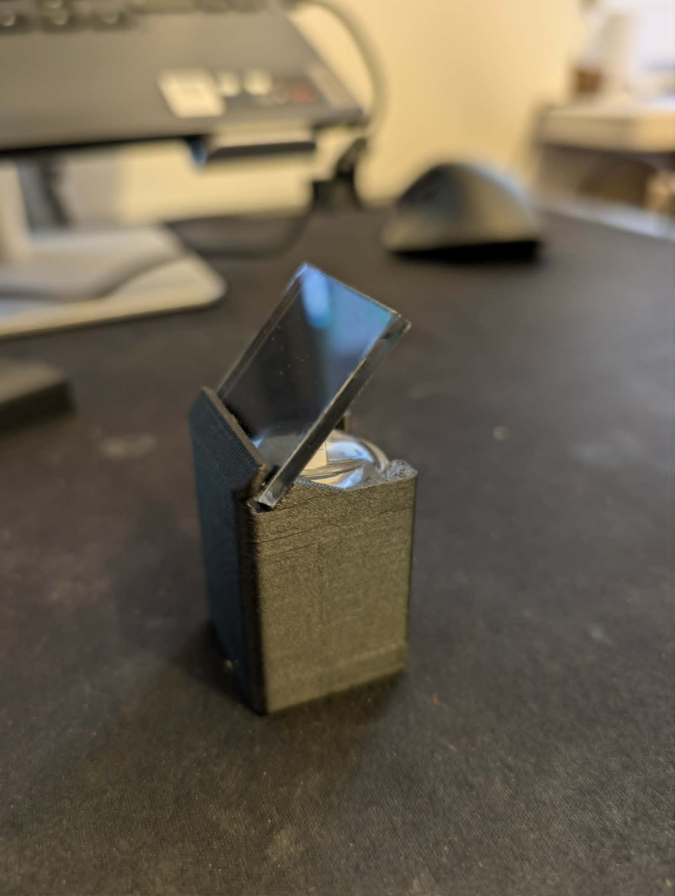
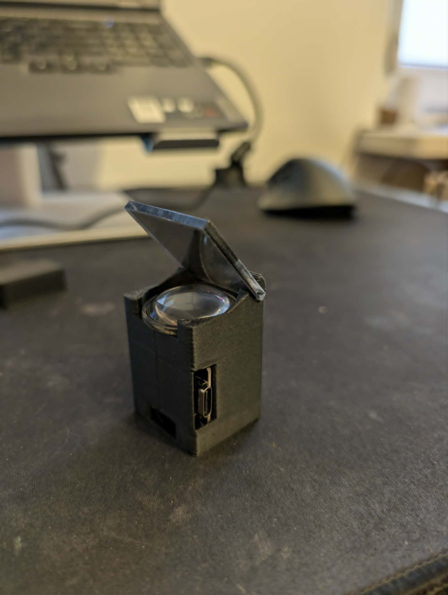
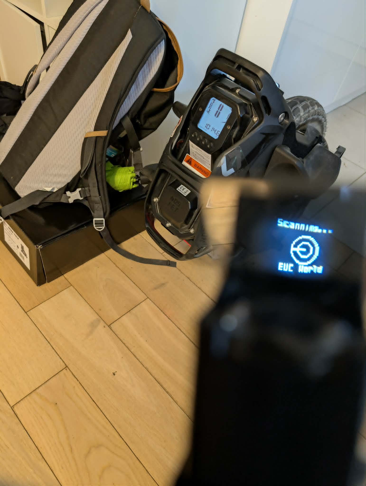
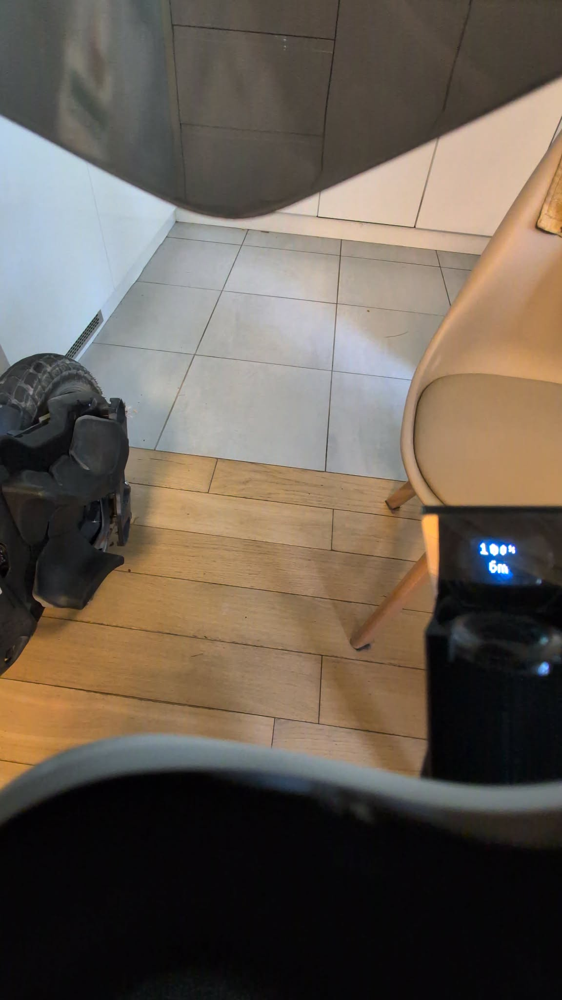
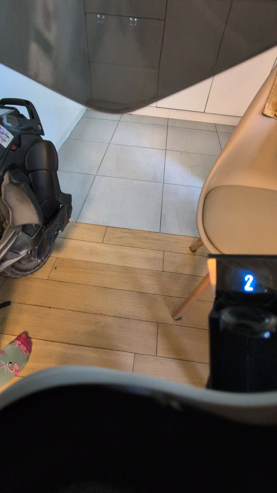
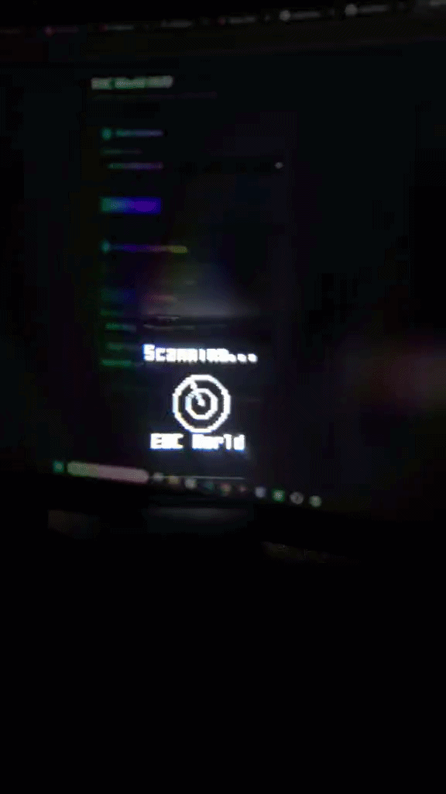
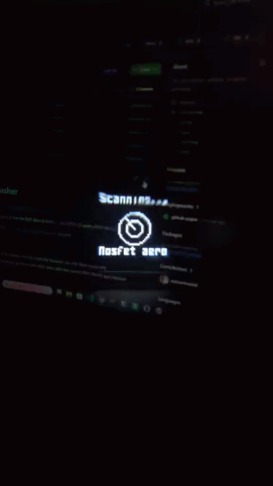

# EUC World HUD Flasher

Flasher available  under
https://ostrzeniewskit.github.io/euc_hud_flasher/

Web-based firmware flasher and configurator for the **EUC World HUD** — an ESP32-C3 optics HUD device.

This tool is the companion flasher for the [EUC-HUD-Optics-Configurator](https://github.com/ostrzeniewskit/EUC-HUD-Optics-Configurator) project.

## What it does

- Flashes firmware to the ESP32-C3 HUD device directly from the browser via USB (Web Serial API)
- Lets you read and set the BLE device name prefix so the HUD pairs with the correct EUC World app instance

## Requirements

- Chrome or Edge on desktop (Web Serial API required)
- ESP32-C3 HUD connected via USB

## Usage

1. Open `index.html` (or the hosted GitHub Pages URL) in Chrome/Edge
2. **Step 1 — Flash Firmware**: Click "Install Firmware" and follow the on-screen prompts to flash the ESP32-C3
3. **Step 2 — Configure Device Name**: Click "Connect", then read or set the BLE name prefix
   - Default `EUC World` matches any EUC World app instance
   - Use a full name like `EUC World 123456` to target a specific phone

## Firmware files

| File | Flash offset | Description |
|------|-------------|-------------|
| `bootloader.bin` | `0x0000` | ESP32-C3 bootloader |
| `partitions.bin` | `0x8000` | Partition table |
| `firmware.bin` | `0x10000` | Application firmware |

New firmware releases are placed in the [`firmware/`](firmware/) folder.

## Updating firmware

To release a new firmware version:

1. Build the new binaries (bootloader, partitions, firmware)
2. Place them in the `firmware/<version>/` subfolder (e.g. `firmware/1.1.0/`)
3. Update `manifest.json` to point to the new binary paths
4. Copy or symlink the files to the repo root if needed for the current live release

## License

[CC BY-NC 4.0](https://creativecommons.org/licenses/by-nc/4.0/) — free to use and adapt with attribution, non-commercial only. See [LICENSE](LICENSE).

---

## Gallery

### Hardware

| | |
|---|---|
|  |  |
| 3D-printed housing — mirror & display side | 3D-printed housing — lens side with USB-C port |

### HUD in action

| | |
|---|---|
|  |  |
| Rider POV — battery & range | Rider POV — speed |

### Demo

*HUD scanning for BLE — device name set via the flasher*

*Custom device name ("Nosfet aero") configured through the flasher*
